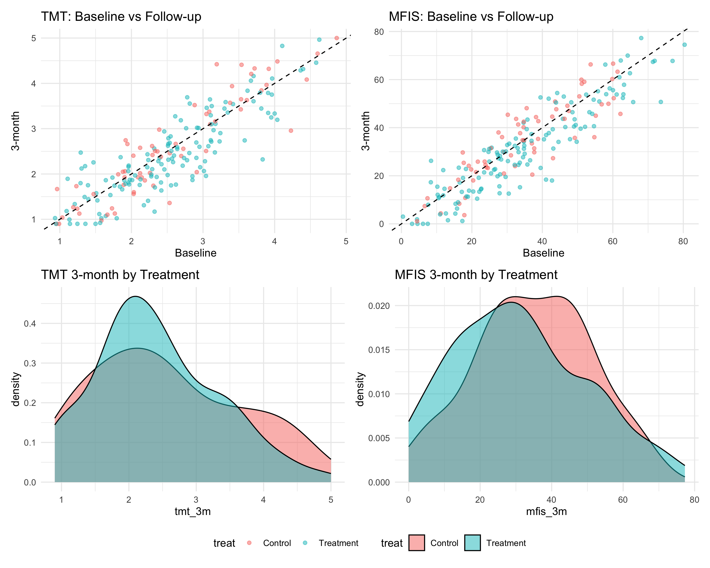

# Taurine Long COVID Bayesian Clinical Trial Simulation

A Bayesian simulation-based sample size determination for a clinical trial investigating taurine supplementation in Long COVID patients.

## Overview

This project provides:
- **Bayesian power analysis** for co-primary outcomes (TMT B/A Ratio and MFIS)
- **Interim analysis** with efficacy/futility stopping rules
- **Reproducible Quarto report** documenting methodology and results

### Simulation Validation

The simulation framework generates clinically realistic data with proper truncation and correlation structure:



## Project Structure

```
taurinelc/
├── _quarto.yml              # Quarto book configuration
├── index.qmd                # Executive summary
├── report/                  # Quarto chapters
│   ├── 01-introduction.qmd  # Clinical context
│   ├── 02-methods.qmd       # Bayesian model specification
│   ├── 03-simulation.qmd    # Data generation methodology
│   ├── 04-power-analysis.qmd
│   ├── 05-interim-analysis.qmd
│   ├── 06-results.qmd
│   └── 07-sensitivity.qmd
├── R/                       # R source functions
│   ├── _setup.R             # Package loading
│   ├── parameters.R         # Trial parameters
│   ├── simulate_data.R      # Data generation
│   ├── fit_model.R          # Model fitting
│   ├── power_analysis.R     # Power estimation
│   ├── interim_analysis.R   # Stopping rules
│   └── visualization.R      # Plotting
├── stan/                    # Stan models
│   ├── coprimary_model_v4.stan  # Canonical model
│   └── coprimary_model_v3.stan  # Sensitivity analysis
├── data/
│   └── cached_results/      # Pre-computed results
├── _output/                 # Rendered report
└── _archive/                # Original subprojects
```

## Quick Start

### Prerequisites

```r
# Install required packages
install.packages(c("tidyverse", "furrr", "mvtnorm", "truncnorm", "here"))

# Install cmdstanr
install.packages("cmdstanr", repos = c("https://mc-stan.org/r-packages/", getOption("repos")))
cmdstanr::install_cmdstan()
```

### Run Analysis

```r
# Load all functions
source("R/_setup.R")
source("R/parameters.R")
source("R/simulate_data.R")
source("R/fit_model.R")
source("R/power_analysis.R")
source("R/interim_analysis.R")
source("R/visualization.R")

# View parameters
print_parameters()

# Compile model
model <- compile_model()

# Run power analysis (computationally intensive)
power_results <- estimate_power_curve(
  sample_sizes = seq(120, 480, by = 60),
  model = model,
  n_reps = 100,
  parallel = TRUE
)

# Estimate required sample size for 90% power
required_n <- estimate_required_n(power_results)
print_power_summary(power_results, required_n)
```

### Render Report

```bash
quarto render
```

## Key Parameters

| Parameter | Value |
|-----------|-------|
| Co-primary outcomes | TMT B/A Ratio, MFIS |
| Randomization | 2:1 (Treatment:Control) |
| Decision threshold | 95% posterior probability |
| Target power | 90% |
| Efficacy stopping | P(benefit) > 0.95 for both outcomes |
| Futility stopping | P(benefit) < 0.10 for either outcome |

## Archived Projects

The `_archive/` folder contains the original subprojects that were consolidated:
- `taurinelc_bayesian/` - Original Bayesian models and functions
- `taurinelc_samplesize/` - Frequentist/Bayesian comparison
- `taurinelc_ss_simulation/` - Alternative simulation approaches
- `taurinelc_ess/` - Effect size sensitivity analysis

## Acknowledgments

This project was developed with assistance from [Claude Code](https://claude.ai/code), Anthropic's AI coding assistant.

## License

MIT License - see [LICENSE](LICENSE) for details.

## Contact

Lawrence Richer - lricher@ualberta.ca
